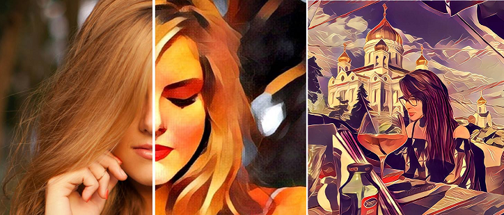
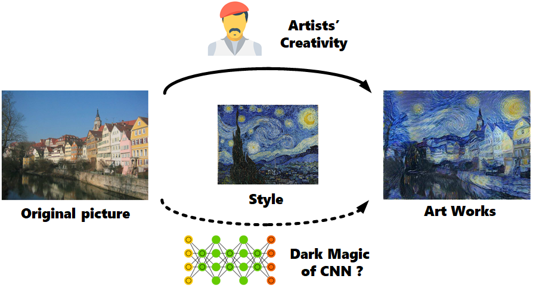
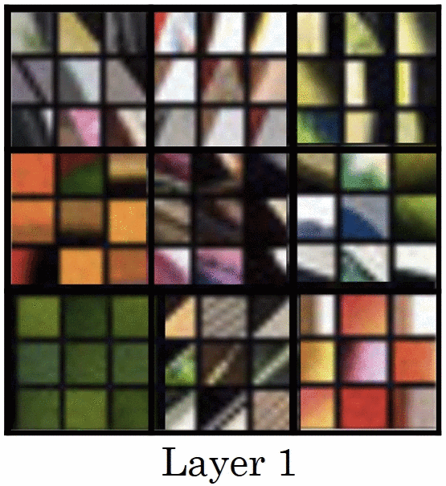
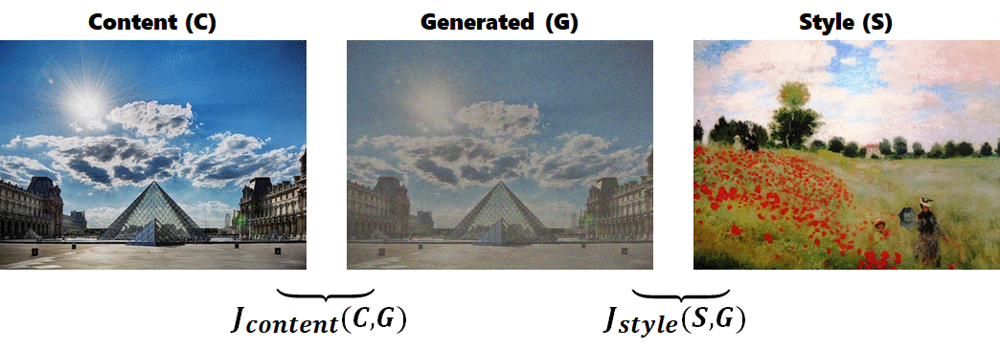
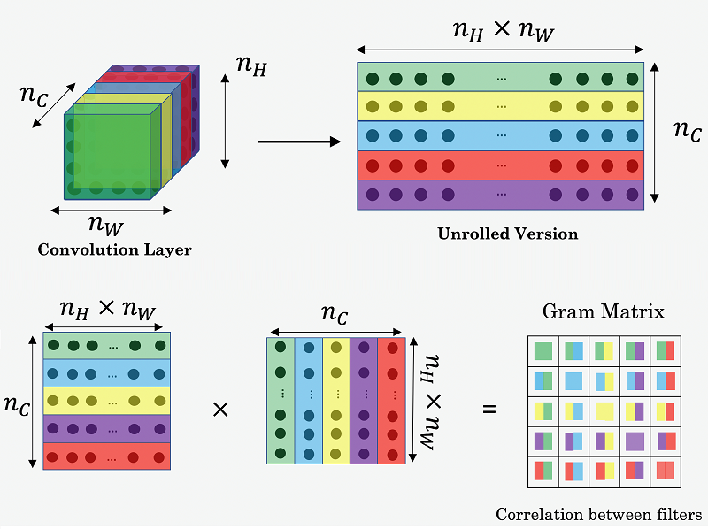
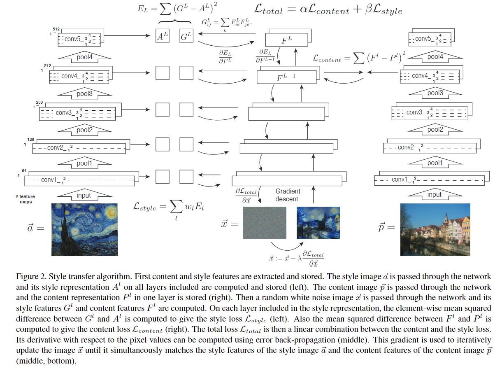
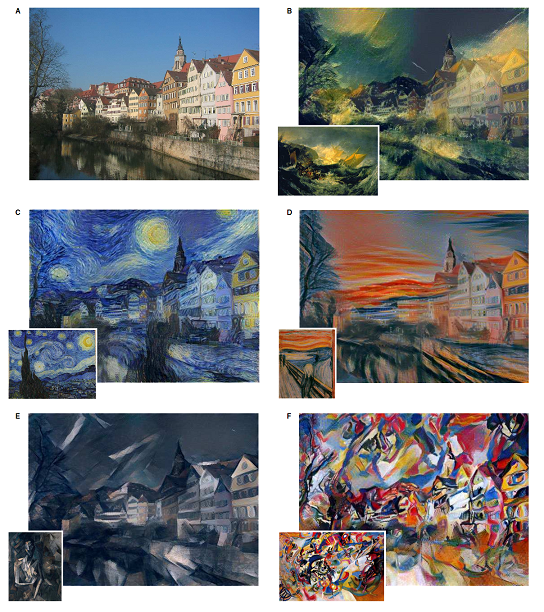
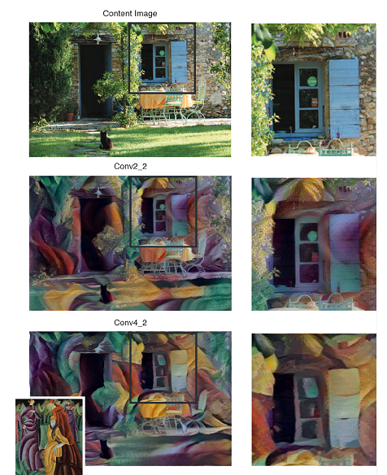
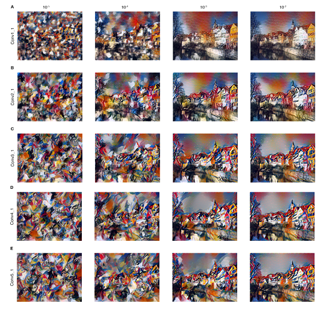
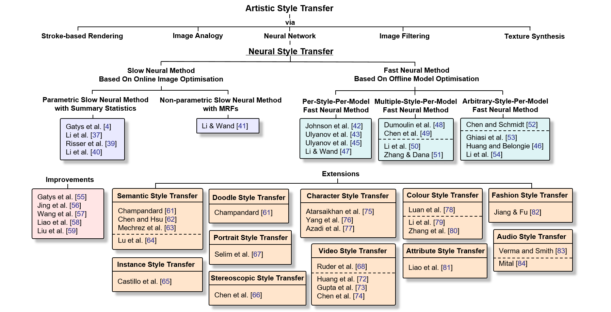



講解影片連結在[這裡](https://www.youtube.com/watch?v=G3gd5jo5nJA){:target="_blank"}。這篇論文內容比較簡單，所以講解重點擺在讓大家理解論文內容，若理解論文應該可以很快看懂code。

## 1. What's Neural Style Transfer?

大家對Style Transfer這個詞可能很陌生，但應該很多人記得2016年在Apple Store和Google Play兩大平台皆奪下年度App的[Prisma](https://prisma-ai.com){:target="_blank"}，將照片轉換成畫作的功能大受歡迎，或者你也可能記得或甚至使用過[Facebook開發的real-time藝術畫風濾鏡](https://www.facebook.com/zuck/videos/10103204449698911/){:target="_blank"}。

<i>Fig. 1. Prisma範例圖片(Source: <a href="https://www.facebook.com/getprisma"> Prisma FB fanpage</a> )</i> 

Neural Transfer就是這種將畫作上的藝術風格移植到其他圖片上的技巧，而這周要介紹的論文實作便是這項技術的開山之作《[A Neural Algorithm of Artistic Style](https://arxiv.org/abs/1508.06576){:target="_blank"}》(2015年發布於arXiv，2016年發表於[CVPR](https://www.cv-foundation.org/openaccess/content_cvpr_2016/html/Gatys_Image_Style_Transfer_CVPR_2016_paper.html){:target="_blank"}上)，作者為來自德國University of Tübingen的計算神經科學學者[Leon A. Gatys](https://github.com/leongatys?tab=repositories){:target="_blank"}, Alexander S. Ecker, [Matthias Bethge](http://bethgelab.org/people/){:target="_blank"}，他們嘗試用CNN來實現這一項過去被認為是專屬於人類的技能並獲得廣大迴響，三人也憑此技術創立一家[公司](https://deepart.io){:target="_blank"}。

<i>Fig. 2. Style Transfer領域試圖將不同畫作風格融合進任意圖片中</i> 

## 2. How it works?

本篇論文的作法其實可以寫成簡單的一段話:

>**TL;DR**: 使用一個pretrained CNN model，輸入內容圖(C)、風格圖(S)、輸出圖(G)三個圖片(其中輸出圖初始化為white noise或noisy內容圖)，選定model中要使用哪幾層，再以三張圖在這幾層中的activation值設計出cost function，最後backprop更新輸出圖(G)上的pixel值。

 下面為更詳盡的介紹:

### 2.0 Rewind: What does CNN captured?

首先，我們要回憶一下CNN架構實際上做了哪些事情，2013年ImageNet冠軍[ZFNet論文](https://arxiv.org/pdf/1311.2901.pdf){:target="_blank"}(也是PyTorch Taipei第二周主題，可以參考士永社長提供之講解[資料](https://www.dropbox.com/s/rrgc205ffedims8/ZFNet_shape.pdf){:target="_blank"}與[影片](https://www.youtube.com/watch?v=e8m46iiBuzw){:target="_blank"})中提到，他們嘗試將每層中activation值最大的部分，還原出是在原圖上的哪個區塊，並發現較為淺層的捲積層捕捉到的只是單純的線條與顏色，然而越深層的捲積層捕捉到的會越趨一個完整的物件。而本篇論文就是**利用CNN架構能捕捉不同規模之特徵的特性，嘗試將不同的紋理與顏色融合到輸入圖中**。

<i>Fig. 3. ZFNet中各層捕捉到的特徵</i> 

### 2.1 Methods

原作作法為輸入以下三張圖進一個已經train好的CNN model(原作使用VGG19，VGG[論文](https://arxiv.org/pdf/1409.1556/){:target="_blank"}可參考PyTorch Taipei第五周由陳峻廷所提供之講解[資料](https://medium.com/@danjtchen/vgg-%E6%B7%B1%E5%BA%A6%E5%AD%B8%E7%BF%92-%E5%8E%9F%E7%90%86-d31d0aa13d88){:target="_blank"}和[影片](https://www.youtube.com/watch?v=XmLeY953zaY){:target="_blank"})中:

1. 內容圖(C): 想要將風格套用於其上的圖片
2. 風格圖(S): 含有特殊風格的圖片
3. 輸出圖(G): 初始化為和C一樣大的white noise圖片，或是也可以輸入有雜訊的內容圖

再選擇特定捲積層之activation值，分別計算C, G之間的cost function $J_{content}$ 和S, G之間的cost function $J_{style}$，以不同比例相加得到最後的cost function $J(G)$

$$ J(G) = \alpha J_{content} + \beta J_{style} $$

透過backprop迭代更新輸出圖(G)上的pixel值以降低$J(G)$，其中$\alpha$和$\beta$的比值可以經調整得到不一樣的輸出效果。

<i>Fig. 4. 以backprop更新輸出圖之範例(輸出圖G初始化為noisy的內容圖C)</i> 

### 2.2 Content Cost Function

內容圖(C)和輸出圖(G)之間的cost function為**特定某一捲積層**activation值的函數，這一層通常位在整體架構較中間的位置(原作使用VGG19的conv4_2)：

$$ J_{content} = \frac{1}{2} \parallel a^{[l]\left( C \right)   } - a^{[l]\left( G \right)  } \parallel ^2 $$

其中 $ a^{[l]\left( C \right) }$ 和 $ a^{[l]\left( G \right)   }$ 分別為內容圖(C)和輸出圖(G)在第$l$層的activation值。如果 $J_{content}$ 小代表內容圖(C)和輸出圖(G)在相同位置上具有相似的特徵。

### 2.3 Style Cost Function

風格圖(S)和輸出圖(G)之間的cost function較為複雜，是一個**特定數層捲積層**activation值的函數(原作使用VGG19的conv1_1, conv2_1, conv3_1, conv4_1, conv5_1)，目的是要**得到channels之間的correlation**。

首先要看其中一層的cost function $J_{style}^{[l]}(S,G)$，實際上為風格圖(S)和輸出圖(G)的[Gram matrix](https://en.wikipedia.org/wiki/Gramian_matrix){:target="_blank"}之normalized mean-sqaured distance。

風格圖(S)和輸出圖(G)在model中第$l$層的Gram matrices $ g^{[l]} $ 大小為 $n_C^{[l]} \times n_C^{[l]}$，矩陣內entry值可列式為:

$$ g_{k,k'}^{[l] \left( S \right)} = \sum_{i=1}^{n_H^{[l]}} \sum_{j=1}^{n_W^{[l]}} a_{ijk}^{[l] \left( S \right)} a_{ijk'}^{[l] \left( S \right)} $$

$$ g_{k,k'}^{[l] \left( G \right)} = \sum_{i=1}^{n_H^{[l]}} \sum_{j=1}^{n_W^{[l]}} a_{ijk}^{[l] \left( G \right)} a_{ijk'}^{[l] \left( G \right)} $$

其中 $ a_{ijk}^{[l]} $ 表示該捲積層中位置(height, width, channel)=(i,j,k)的activation值。

不過gram matrix還是以圖來表示較容易理解:

<i>Fig. 5. Gram matrix的entry為任兩個channel之間activation值的內積 (Source: <a href="https://www.deeplearning.ai"> Deeplearning.ai</a>)</i> 

有了gram matrix便可得到該層style cost function:

$$ J_{style}^{[l]}(S,G) = \frac{1}{\left( 2 n_H^{[l]} n_W^{[l]} n_C^{[l]} \right) ^2} \parallel g^{[l] \left( S \right)} - g^{[l] \left( G \right)}\parallel ^2 $$

$$ J_{style}^{[l]}(S,G) = \frac{1}{\left( 2 n_H^{[l]} n_W^{[l]} n_C^{[l]} \right) ^2} \sum_k \sum_{k'} \left( g_{k,k'}^{[l] \left( S \right)} - g_{k,k'}^{[l] \left( G \right)} \right)^2 $$

而每一層的 $ J_{style}^{[l]} $ 再以不同weighting $ \lambda^{[l]} $ 相加得到 $ J_{style} $ (原作五層weighting都是0.2):

$$ J_{style} = \sum_l \lambda^{[l]} J_{style}^{[l]} $$

### 2.4 Overall Process

總而言之，$J_{content}$ 只運用CNN架構中的某一層的activation值，降低$J_{content}$會使輸出圖(G)在內容圖(C)相同位置上出現一樣的特徵，而$J_{style}$ 的計算涵蓋多層的activation值，降低$J_{style}$會使輸出圖(G)和風格圖(S)在CNN某層上不同channel所抓取到的特徵關係相近(不考慮特徵出現位置)。

CVPR論文內的一張圖(點擊放大)可以概括說明整個流程:

<i>Fig. 7. Style Transfer 演算法流程</i> 

## 3. Result

論文有展示一些調整參數的效果，這裡只是撿過來放而已。

<i>Fig. 8. 同一張內容圖施以不同風格之結果</i> 

圖8的A為原圖，B~E為施加不同風格圖的結果，而其所合適之$\alpha / \beta$值也不同: B為$1 × 10^{−3}$, C為$8 × 10^{−4}$, D為$5 × 10^{−3}$, E和F為$5 × 10^{−4}$。

<figure class="half">
  
    
    <figcaption></figcaption>
</figure>

<i>Fig. 9. 不同參數之表現比較。</i> 

**圖9左圖**: 相同$\alpha / \beta$值與style cost function，但content cost function選取不同層的結果，哪個表現比較好應該是見仁見智(?)。

**圖9右圖**:橫軸為不同的 $\alpha / \beta$值，縱軸為style cost function涵蓋不同層數，row A為只計算conv1_1一層、row B為計算conv1_1和conv2_1兩層、row C涵蓋三層...依此類推。可見$\alpha / \beta$越小則輸出圖(G)和內容圖(C)相去越遠而只含有風格特徵。而當style cost function只計算conv1_1一層則表現出較細微的風格特徵，計算涵蓋越深層則有較大的風格特徵。

## 4. Sample Code

請移駕至[講者的GitHub](https://github.com/mattwang44/PyTorchTP_Style_Transfer){:target="_blank"}，有Tensorflow版本(吳恩達課程內的作業，使用VGG16)，和PyTorch版本(論文第一作者的repo及官方教學文件)。

## 5. Discussion

本篇論文演算法較為簡單，然而實際運行結果有一些比較明顯的缺失:

1. 未考慮空間、亮度等因素: 例如可能會把地面的特徵套用在天空之類的情況。不過第一作者後續有出了數篇針對改善這個缺點的論文，像是[這篇](https://arxiv.org/pdf/1606.05897.pdf){:target="_blank"}和[這篇](https://arxiv.org/abs/1611.07865){:target="_blank"}。
2. 又肥又慢: VGG在CNN發展歷史中曾獲得一時的勝利是因為增加了很多層的捲積層，造成model很佔空間、執行時間也比較久。不過在本文開頭就告訴大家已經有real-time的產品，代表已經有多篇關於能夠快速執行style transfer的論文被發表了。

目前已經有style transfer領域的[review paper](https://github.com/ycjing/Neural-Style-Transfer-Papers){:target="_blank"}了，有興趣可以去看看學界後來又延伸發展了那些主題或改善方法。

## Reference

1. 本篇文章介紹之style transfer論文
  * 在arXiv上發布的論文: [Gatys, L.A., Ecker, A.S., Bethge, M.: A neural algorithm of artistic style. arXiv preprint arXiv:1508.06576 (2015)](https://arxiv.org/abs/1508.06576){:target="_blank"}
  * 在CVPR上發表的論文: [L. A. Gatys, A. S. Ecker and M. Bethge, "Image Style Transfer Using Convolutional Neural Networks," 2016 IEEE Conference on Computer Vision and Pattern Recognition (CVPR), Las Vegas, NV, 2016, pp. 2414-2423. doi: 10.1109/CVPR.2016.265](http://ieeexplore.ieee.org/stamp/stamp.jsp?tp=&arnumber=7780634&isnumber=7780329){:target="_blank"}
  * [PyTorch Code @ GitHub](https://github.com/leongatys/PytorchNeuralStyleTransfer){:target="_blank"}
2. ZFNet
  * [Zeiler, Matthew D; Fergus, Rob: Visualizing and Understanding Convolutional Networks. arXiv preprint arXiv:1311.2901 (2014)](https://arxiv.org/abs/1311.2901){:target="_blank"}
3. VGG
  * [Simonyan, Karen; Zisserman, Andrew: Very Deep Convolutional Networks for Large-Scale Image Recognition. arXiv preprint arXiv:1409.1556 (2013)](https://arxiv.org/abs/1409.1556){:target="_blank"}
4. 吳恩達在Coursera上開設之深度學習線上課程
  * [Deeplearning.ai@Coursera](https://www.deeplearning.ai){:target="_blank"}
  * [Style Transfer講解影片](https://www.youtube.com/watch?v=R39tWYYKNcI&list=PLkDaE6sCZn6Gl29AoE31iwdVwSG-KnDzF&index=37){:target="_blank"}
  * [課程介紹]by講者(https://mattwang44.github.io/en/articles/coursera-dlai-spec/){:target="_blank"}
5. [PyTorch official tutorial](https://pytorch.org/tutorials/advanced/neural_style_tutorial.html){:target="_blank"}
6. Mark Chang's [slides](https://www.slideshare.net/ckmarkohchang/a-neural-algorithm-of-artistic-style){:target="_blank"} & [video](https://www.youtube.com/watch?v=qzGuYuCpy1M){:target="_blank"} (偏重實驗的講解，很值得一看)
7. Neural Style Transfer: A Review
  * [論文](https://arxiv.org/pdf/1705.04058.pdf){:target="_blank"}
  * [GitHub](https://github.com/ycjing/Neural-Style-Transfer-Papers){:target="_blank"}
  * 內有該領域相關論文整理:

