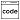



## 1. PyTorch Taipei 緣起

[PyTorch Taiwan](https://www.facebook.com/groups/2027602154187130/){:target="_blank"}是[Marcel Wang](https://www.linkedin.com/in/marcel-wang-3a988b7a/){:target="_blank"}先生為促進台灣深度學習發展，在網路上號召成立的深度學習讀書會，
目前有[台北](http://hemingwang.blogspot.tw/2018/01/pytorchpytorch-taipei_20.html){:target="_blank"}、[新竹](http://hemingwang.blogspot.tw/2018/01/pytorchpytorch-hsinchu.html){:target="_blank"}和[台中](http://hemingwang.blogspot.tw/2018/04/pytorchpytorch-taichung_26.html){:target="_blank"}三分會。

2018.03.08 第一次讀書會(PC: [Eric Yang](https://www.facebook.com/profile.php?id=1561001417){:target="_blank"})

## 2. 相關資訊

* 時間：每周四晚上 19:00~21:00
* 地點：台大資工系德田館 (確切舉辦教室請關注每周在[社團](https://www.facebook.com/groups/2027602154187130/){:target="_blank"}公布的活動訊息)

## 3. 講者徵求

1. 若有興趣當講者，請至 [此文](https://www.facebook.com/groups/2027602154187130/permalink/2060273964253282/){:target="_blank"} 留言，將有人加您進Facebook的報告者聊天視窗。請記得說明想報告的主題(特定論文或是NLP、數學)。
2. 一個主題亦歡迎多位講者參與(每周至少一位)，若一個主題有多位參與則列在下表的即為該主題的負責人。
3. 下列進度表僅初步規劃:
    * 上半場的論文討論主題，每個主題可能1~3周不等的報告份量，目前主要是接續春季YOLO和Inception的改進版本以及optimization, normalization, regularization技巧。
    * 下半場是NLP和深度學習相關的數學，NLP部分目前仍在規劃中，有興趣的講者可以先報名，待日程表確定後再讓大家選擇主題。

**各位有甚麼想法歡迎在 [PyTorch Taipei Facebook社團](https://www.facebook.com/groups/2027602154187130/){:target="_blank"} 一起討論!!**

## 4. 日程表

<link rel="stylesheet" href="../../custom.css">

  <!-- 這部分待更新 -->
  <!--
  

    
 <a href="https://drive.google.com/open?id=12AYDi8JCsqYVXJH7jbexuu3LHtqtudiz" target="_blank">全部論文下載</a> 
     <a href="https://docs.google.com/spreadsheets/d/1qYJ5rOL7gotjbcXTVPDvclyZptZ-cRpYcDbdWk3PMt4/edit?usp=sharing" target="_blank">每周講者列表</a> 
     <a href="https://github.com/pecu/PyTorch_CSX" target="_blank">實作進度表</a>  <a href="https://www.youtube.com/channel/UCk_f2g9Dkc4WaqrqpzxywJw" target="_blank">PyTorchTP</a>

  

  -->
  

    
: 論文PDF 
    : 官方程式/Demo 
    : 講者之講解材料

  

|日期            | 上半場主題                                                                                                                                           | 講者                  | 下半場主題                                                                                                      | 講者               |
|:--------------:|:---------------------------------------------------------------------------------------------------------------------------------------------------:|:--------------------:|:---------------------------------------------------------------------------------------------------------------:|:------------------:|
| 8/23           | **Inception v2**                         [![][p]][Iv2p]{:target="_blank"} [      ][Iv2c]{:target="_blank"} [      ][Iv2m]{:target="_blank"}      | 康仕承               | - | -
| 8/30           | **Inception v3&v4**                      v3[![][p]][Iv3p]{:target="_blank"}, v4[![][p]][Iv4p]{:target="_blank"} [      ][I34m]{:target="_blank"} | 楊哲寧               | - | -          
| 9/13           | **Feature Pyramid Networks**             [![][p]][FPNp]{:target="_blank"} [      ][FPNc]{:target="_blank"} [      ][FPNm]{:target="_blank"}      | 郭瑞申               | **Linear Algebra I**                     [![][p]][m1p]{:target="_blank"} [      ][m1m]{:target="_blank"}     | Rose Teng                
| 9/20           | **RetinaNet**                            [![][p]][rtnp]{:target="_blank"} [![][c]][rtnc]{:target="_blank"} [      ][rtnm]{:target="_blank"}      | 王威翔               | **Linear Algebra II**                    [![][p]][m1p]{:target="_blank"} [      ][m1m]{:target="_blank"}     | 陳彥吉
| 9/27           | **YOLO v2**                              [![][p]][Yv2p]{:target="_blank"} [![][c]][Yv2c]{:target="_blank"} [      ][Yv2m]{:target="_blank"}      | 林家豪               | **Probability & Information Theory**     [![][p]][m2p]{:target="_blank"} [      ][m2m]{:target="_blank"}     | 康仕承
| 10/4           | **YOLO v3**                              [![][p]][Yv3p]{:target="_blank"} [![][c]][Yv3c]{:target="_blank"} [      ][Yv3m]{:target="_blank"}      | 郭瑞申               | **Numerical Computation**                [![][p]][m3p]{:target="_blank"} [      ][m3m]{:target="_blank"}     | 缺                 |    
| 10/11          | **MobileNet**                            [![][p]][mbnp]{:target="_blank"} [      ][mbnc]{:target="_blank"} [      ][mbnm]{:target="_blank"}      | 郭宗賢               | **Machine Learning Basics I**            [![][p]][m4p]{:target="_blank"} [      ][m4m]{:target="_blank"}     | Rose Teng          |  
| 10/25          | **Gradient Descent & Momentum**          BGD, SGD, Mini-batch GD, NAG[      ][gdmp]{:target="_blank"} [      ][gdmc]{:target="_blank"} [      ][gdmm]{:target="_blank"}    | 缺                   | **Machine Learning Basics II**           [![][p]][m4p]{:target="_blank"} [      ][m5m]{:target="_blank"}     | 缺                 |
| 11/01          | **Adaptive Methods**                     AdaGrad, AdaDelta, RMSprop[      ][am1p]{:target="_blank"} [      ][am1c]{:target="_blank"} [      ][am1m]{:target="_blank"}      | 缺                   | NLP (主題整理中)                                                                       | 缺
| 11/08          | **Adaptive Methods with Momentum**       Adam, AdaMax[      ][am2p]{:target="_blank"} [      ][am2c]{:target="_blank"} [      ][am2m]{:target="_blank"}                    | Rose Teng            | NLP (主題整理中)                                                                       | 缺
| 11/15          | **Improvements of Adam**                 NAdam, AMSGrad[      ][iadp]{:target="_blank"} [      ][iadc]{:target="_blank"} [      ][iadm]{:target="_blank"}                  | 缺                   | NLP (主題整理中)                                                                       | 缺
| 12/6           | **Layer Normalization**                  [![][p]][lnlp]{:target="_blank"} [      ][lnlc]{:target="_blank"} [      ][lnlm]{:target="_blank"}      | 楊明翰               | NLP (主題整理中)                                                                                                 | 缺
| 12/13          | **Group Normalization**                  [      ][gnlp]{:target="_blank"} [      ][gnlc]{:target="_blank"} [      ][gnlm]{:target="_blank"}      | 康仕承               | NLP (主題整理中)                                                                                                 | 缺
| 12/20          | **Regularization I**                     weight decay, L1, L2 [      ][rg1m]{:target="_blank"}                                                   | Yvon Wong            | NLP (主題整理中)                                                                                                 | 缺                 |  
| 12/27          | **Regularization II**                    dropout, dropconnect [      ][rg1m]{:target="_blank"}                                                   | 缺                   | NLP (主題整理中)                                                                                                 | 缺                 |

<!-- 12/27 -->
<!-- 1/3,10,17,24,31 -->
<!-- ntu_schedule http://www.aca.ntu.edu.tw/calendar/calendar107.xls -->
<!-- | RNN                                 | 林振雄              |    -->

[p]: ../../../images/icons/paper.png
[c]: ../../../images/icons/coding.png
[m]: ../../../images/icons/mt.png

<!-- Inception -->
[Iv2p]: https://arxiv.org/abs/1512.00567
[Iv2c]: ...
[Iv2m]: ...
[Iv3p]: https://arxiv.org/abs/1512.00567
[Iv4p]: https://arxiv.org/abs/1602.07261
[I34m]: ...

<!-- FPN -->
[FPNp]: https://arxiv.org/abs/1612.03144
[FPNc]: ...
[FPNm]: ... 

<!--    -->
[rtnp]: https://arxiv.org/pdf/1708.02002
[rtnc]: https://github.com/facebookresearch/Detectron
[rtnm]: ...

<!-- YOLO v2 -->
[Yv2c]: https://pjreddie.com/darknet/yolov2/
[Yv2p]: https://arxiv.org/abs/1612.08242
[Yv2m]: ...

<!-- YOLO v3 -->
[Yv3c]: https://pjreddie.com/darknet/yolo/
[Yv3p]: https://pjreddie.com/media/files/papers/YOLOv3.pdf
[Yv3m]: ...

<!-- Mobilenet -->
[mbnp]: https://arxiv.org/pdf/1704.04861.pdf
[mbnc]: ...
[mbnm]: ...

<!--    -->
[gdmp]: ...
[gdmc]: ...
[gdmm]: ...

<!--    -->
[am1p]: ...
[am1c]: ...
[am1m]: ...

<!--    -->
[am2p]: ...
[am2c]: ...
[am2m]: ...

<!--    -->
[iadp]: ...
[iadc]: ...
[iadm]: ...

<!--    -->
[lnlp]: https://arxiv.org/abs/1607.06450
[lnlc]: ...
[lnlm]: ...

<!--    -->
[gnlp]: ...
[gnlc]: ...
[gnlm]: ...

<!--    -->
[rg1p]: ...
[rg1m]: ...
[rg2p]: ...
[rg2m]: ...

<!-- Math -->
[m1p]: http://www.deeplearningbook.org/contents/linear_algebra.html
[m2p]: http://www.deeplearningbook.org/contents/prob.html
[m3p]: http://www.deeplearningbook.org/contents/numerical.html
[m4p]: http://www.deeplearningbook.org/contents/ml.html

[m1m]: ...
[m2m]: ...
[m3m]: ...
[m4m]: ...
[m5m]: ...
